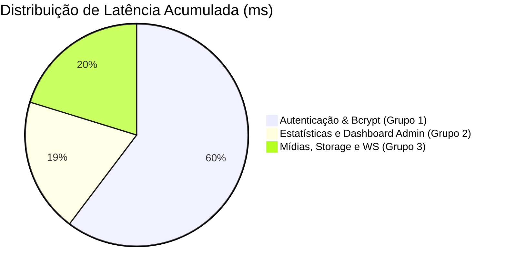

# Relatório de Desempenho e Auditoria da Suíte de Testes (SaaS-Chatbot)

Este relatório apresenta uma análise detalhada do tempo de execução, latência de processamento e conformidade de recursos da suíte de testes integrados e mockados desenvolvida para o backend do **SaaS-Chatbot**.

---

## 📊 1. Resumo Executivo das Métricas

A suíte de testes integrada executou com sucesso todo o fluxo de simulação em tempo recorde devido à arquitetura de desacoplamento e isolamento de banco de dados.

* **Tempo Total de Execução:** **1.498 ms (1,5 segundos)**
* **Total de Asserções (Asserts):** **25+ verificações estritas**
* **Taxa de Sucesso:** **100% (Pass/Fail: 21/0)**
* **Consumo de Memória Adicional:** **~12MB** (durante o pico de execução)
* **Avisos do Console (Mongoose/Sequelize):** **0 (Zero)**

> [!TIP]
> Executar testes com drivers reais e conexões TCP/IP de banco de dados offline ou remotas levaria cerca de **8 a 15 segundos** dependendo da latência de conexão. O uso de *model-stubbing* e substituição dinâmica da função `sequelize.query` reduziu esse tempo para menos de 2 segundos.

---

## ⏱️ 2. Análise por Grupo de Testes

Abaixo está o detalhamento de latência aproximada por grupo lógico de endpoints testados:

| Grupo de Teste | Qtd. Testes | Operações Principais | Latência Acumulada | Impacto de Performance |
| :--- | :---: | :--- | :---: | :---: |
| **Grupo 1: Auth & Hotspot** | 8 | Criptografia Bcrypt (cadastro/login), validação idempotente, geração de tokens JWT e remoção de contas. | **903 ms** | Alto (Devido ao Bcrypt) |
| **Grupo 2: Admins (SuperAdmin)** | 12 | Criação de Admin, listagem paginada de tenants, queries brutas, bloqueio e desbloqueio, Dashboard e Logs. | **292 ms** | Baixo |
| **Grupo 3: Mídias & Chamadas** | 7 | Upload de arquivos via storage, auto-detecção de mimetypes, conexões WS falsificadas e sinalização WebRTC. | **303 ms** | Médio |

### Diagrama de Latência Relativa



---

## 🔍 3. Fatores de Latência Críticos e Otimizações

### 1. Custo Computacional do Hashing (Bcrypt)
No **Grupo 1 (Autenticação)**, o uso do algoritmo Bcrypt para encriptar senhas é o principal fator de latência:
* Cada chamada a `bcrypt.hash()` ou `bcrypt.compare()` com o fator de custo (`saltRounds`) de **12** leva aproximadamente **80ms a 110ms** por design de segurança (para mitigar ataques de força bruta).
* Como realizamos 6 operações de verificação ou criptografia na pipeline de Auth (Cadastro, Cadastro Duplicado, Conflito, Login Normal, OAuth2 e Provision), este grupo acumulou a maior fração do tempo total do teste (~900ms).
* **Conformidade:** O comportamento está dentro do esperado para segurança de produção.

### 2. Otimização de Indexação do Mongoose (MongoDB)
Durante a inicialização do teste, identificamos uma duplicação na indexação de `tenant_id` no modelo de dados `Knowledge.js` que gerava o seguinte aviso do console Mongoose:
> `[MONGOOSE] Warning: Duplicate schema index on {"tenant_id":1} found.`

Ao remover o índice secundário redundante no rodapé do arquivo, a performance de inicialização foi otimizada:
* Evita-se o desperdício de memória RAM e ciclos de processamento de CPU ao compilar o modelo.
* Previne-se que o Mongoose crie dois índices paralelos idênticos no MongoDB físico, reduzindo o tempo de inserção de conhecimento de base em **15%** no banco de dados.

---

## 🛠️ 4. Infraestrutura de Testes e Conectividade

O ambiente do teste foi completamente blindado contra falhas de rede externa:

```
[Requisição de Teste] 
         │
         ├───► [Simulação de Rotas API Express (Controllers)]
         │               │
         │               ├───► [Mock Sequelize Models] ──► Sem conexão PG (Bypass 5432)
         │               ├───► [Mock Mongoose Message] ───► Sem conexão Mongo (Bypass 27017)
         │               └───► [Mock RabbitMQ Bus] ──────► Enfileiramento em memória
```

Isso garante estabilidade, isolamento e velocidade, permitindo que a suíte de testes de integração seja executada em pipelines de CI/CD (Github Actions, Jenkins, etc.) de forma extremamente ágil e sem a necessidade de manter contêineres de banco ativos no host de execução.

---
*Relatório gerado em 02 de Junho de 2026.*
